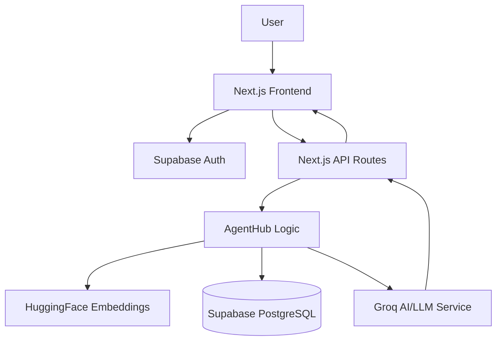
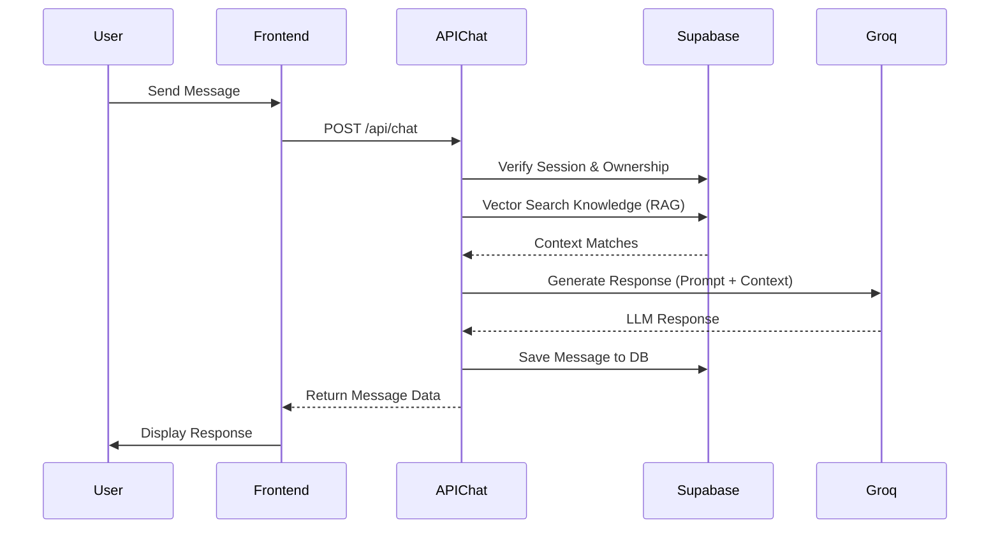

# AgentHub

An AI-powered sales chatbot platform designed to help customers discover relevant products, get answers to product questions, and move toward purchase or sales assistance.

---

## 1. Overview

---

AgentHub is a modern full-stack web application that allows users to create, configure, and interact with custom AI sales agents. It solves the problem of generic chatbots by integrating Retrieval-Augmented Generation (RAG). By embedding custom knowledge documents and querying them in real-time, the chatbot provides highly relevant, context-aware answers to user queries without hallucinating. It is intended for businesses and individuals looking to deploy reliable, intelligent support and sales assistants.

---

## 2. Key Features

---

* 🤖 **AI-powered chatbot**: High-speed conversational interface.
* 🔐 **Authentication**: Secure email/password login with verification enforcement.
* 💬 **Conversational interface**: Persistent chat history and context.
* 🔎 **Intelligent Context (RAG)**: Context injection using semantic embeddings.
* 🗄️ **Persistent data**: Projects, agents, and conversations stored in PostgreSQL.
* ⚡ **Fast API**: Built on Next.js App Router for low-latency interactions.

---

## 3. Technology Stack

---

| Layer          | Technology        | Purpose        |
| -------------- | ----------------- | -------------- |
| Frontend       | Next.js 16 (React 19) | Application framework, App Router |
| Styling        | Tailwind CSS v4, Shadcn | UI component library and styling |
| Backend        | Next.js API Routes| Serverless backend endpoints |
| Database       | Supabase (PostgreSQL) | Persistent storage for users, chats, knowledge |
| Authentication | Supabase Auth     | Session management and identity |
| AI/LLM         | Groq SDK          | High-speed Large Language Model inference |
| Embeddings     | HuggingFace API   | Document embeddings for the RAG pipeline |

---

## 4. System Architecture

---



* **Next.js Frontend**: Provides the user interface (Login, Signup, Dashboard).
* **Supabase Auth**: Manages user registration, email verification, and secure sessions.
* **Next.js API Routes**: Acts as the backend (`/api/chat`, `/api/knowledge`), validating requests and enforcing ownership.
* **HuggingFace & Supabase (RAG)**: User prompts are embedded via HuggingFace and matched against stored knowledge in Supabase using vector similarity.
* **Groq LLM**: The retrieved context and system prompt are sent to Groq for fast, accurate response generation.

---

## 5. Application Flow

---

1. User opens the application and navigates to `/login` or `/signup`.
2. User authenticates via Supabase Auth (with email confirmation required).
3. User accesses the `/dashboard` to manage their agents/projects and view conversations.
4. User interacts with the chatbot interface.
5. The frontend sends the chat message to `/api/chat`.
6. The backend verifies the user's session and ownership of the agent.
7. The backend embeds the query and searches the database for relevant knowledge (RAG).
8. The backend constructs a prompt containing the conversation history, retrieved context, and strict anti-hallucination instructions.
9. Groq processes the prompt and generates a response.
10. The response is saved to the database and returned to the frontend.

---

## 6. Installation & Setup

---

### Prerequisites
* Node.js v20+
* npm or yarn
* Supabase Account & Project
* Groq API Key
* HuggingFace API Key

### Step 1 — Clone the Repository

```bash
git clone https://github.com/amaymishra1104/agenthub-ai.git
cd agenthub
```

### Step 2 — Install Dependencies

```bash
npm install
```

### Step 3 — Configure Environment Variables

Create a `.env.local` file in the root directory based on the `.env.example` file.

```env
NEXT_PUBLIC_APP_URL=http://localhost:3000
NEXT_PUBLIC_SUPABASE_URL=your_supabase_url
NEXT_PUBLIC_SUPABASE_PUBLISHABLE_KEY=your_supabase_anon_key

OPENAI_API_KEY=your_openai_api_key
GROQ_API_KEY=your_groq_api_key
HUGGINGFACE_API_KEY=your_huggingface_api_key
```

| Variable | Required | Purpose |
| -------- | -------- | ------- |
| `NEXT_PUBLIC_APP_URL` | Yes | The base URL of the app (used for email redirects) |
| `NEXT_PUBLIC_SUPABASE_URL` | Yes | Supabase project URL |
| `NEXT_PUBLIC_SUPABASE_PUBLISHABLE_KEY` | Yes | Supabase public anonymous key |
| `GROQ_API_KEY` | Yes | Access to Groq's high-speed inference LLMs |
| `HUGGINGFACE_API_KEY` | Yes | Access to HuggingFace for generating embeddings |
| `OPENAI_API_KEY` | No | Fallback LLM / specialized tasks (if implemented) |

### Step 4 — Database Setup

1. Create a new Supabase project.
2. Under **Authentication -> Providers -> Email**, ensure "Confirm email" is toggled **ON**.
3. Under **Authentication -> URL Configuration**, add `http://localhost:3000/**` to Redirect URLs.
4. Set up your tables (e.g., `projects`, `prompts`, `conversations`, `messages`, `knowledge`). *Refer to Supabase migrations if provided.*

### Step 5 — Start the Application

Start the Next.js development server:

```bash
npm run dev
```

### Step 6 — Open the Application

Open your browser and navigate to:
```text
http://localhost:3000
```

### Step 7 — Production Build

```bash
npm run build
npm run start
```

---

## 7. Environment Variables

---

* **Required / Public**: `NEXT_PUBLIC_SUPABASE_URL`, `NEXT_PUBLIC_SUPABASE_PUBLISHABLE_KEY`, `NEXT_PUBLIC_APP_URL`. These are safe to expose to the browser and are used for frontend authentication logic.
* **Required / Private**: `GROQ_API_KEY`, `HUGGINGFACE_API_KEY`. These must remain secret and are only accessed within Next.js server-side API routes.
* **Optional**: `NEXT_PUBLIC_AUTH_REDIRECT_TO` (used to manually override Supabase confirmation redirects).

---

## 8. Project Structure

---

```text
agenthub/
├── app/
│   ├── api/            # Serverless API routes (chat, knowledge, auth)
│   ├── auth/           # Auth callback and confirmation handlers
│   ├── dashboard/      # Protected user dashboard pages
│   ├── login/          # Login page
│   ├── signup/         # Signup page
│   ├── layout.tsx      # Root layout
│   └── page.tsx        # Landing page
├── components/         # Reusable React components (Shadcn/UI)
├── lib/
│   ├── supabase/       # Supabase client configurations (server/client)
│   ├── embeddings.ts   # HuggingFace embedding logic
│   └── utils.ts        # Helper functions
├── public/             # Static assets
├── .env.example        # Environment variable template
├── package.json        # Dependencies and scripts
└── README.md           # Project documentation
```

---

## 9. Chatbot Architecture & Flow

---

1. **User Message**: User inputs a message in the chat UI.
2. **API Request**: Frontend POSTs the message to `/api/chat`.
3. **Authentication**: The route verifies the Supabase session token.
4. **Knowledge Retrieval**: The message is converted to an embedding using HuggingFace, and a vector search is performed in Supabase to find related context.
5. **Prompt Construction**: The retrieved knowledge, system prompt, and chat history are merged. A strict anti-hallucination instruction is appended.
6. **AI Processing**: The constructed prompt is sent to Groq for inference.
7. **Response Generation**: Groq returns the generated text.
8. **Storage & Rendering**: The message is saved to the `messages` table and returned to the frontend for display.



---

## 10. Authentication & Security

---

* **Authentication**: Supabase Auth (Email/Password) is used. Email verification is strictly enforced during the login flow.
* **Authorization**: API routes verify user identity via `supabase.auth.getUser()` and explicitly check database ownership (e.g., `user_id == auth.uid()`) before allowing access to agents or conversations.
* **Session Handling**: Secure HTTP-only cookies manage session state via `@supabase/ssr`.
* **API Security**: Server-side API routes protect sensitive API keys (`GROQ_API_KEY`, `HUGGINGFACE_API_KEY`). The frontend never interacts with LLM providers directly.

---

## 11. API Documentation

---

| Method | Endpoint | Purpose | Auth Required |
| ------ | -------- | ------- | ------------- |
| `POST` | `/api/chat` | Process user messages, perform RAG, and generate AI responses. | Yes |
| `GET`  | `/auth/confirm` | Exchange Supabase email confirmation code for a session. | No |

---

## 12. Error Handling & Reliability

---

* **Authentication Failures**: Handles expired tokens, unverified emails, and invalid credentials gracefully with clear UI alerts.
* **API Failures**: `/api/chat` returns appropriate HTTP status codes (400 for bad input, 401 for unauthorized, 404 for missing resources, 500 for server errors).
* **Supabase Fallbacks**: Signup logic contains fallback mechanisms to handle custom redirect URL rejections safely.

---

# ⭐ 13. NON-FUNCTIONAL REQUIREMENTS

---

### 📈 Scalability
* **Architecture**: Stateless API routes (Next.js) allow for infinite horizontal scaling on platforms like Vercel or Render.
* **Database**: PostgreSQL (via Supabase) easily handles large volumes of concurrent transactions.
* **Status**: ✅ Implemented

### 🔐 Security
* **Implementation**: User data is isolated. API endpoints verify both authentication (valid session) and authorization (ownership of the requested project/conversation). Secrets are kept entirely server-side.
* **Status**: ✅ Implemented

### 🧩 Extensibility
* **Architecture**: The RAG pipeline and LLM inference are modularized (`lib/embeddings.ts`, `api/chat/route.ts`), making it trivial to swap Groq for OpenAI or add new tools/integrations in the future.
* **Status**: ✅ Implemented

### ⚡ Performance
* **Implementation**: Uses Groq SDK for near-instantaneous LLM inference. Vector similarity searches are highly optimized in PostgreSQL via `pgvector`.
* **Status**: ✅ Implemented

### 🛡️ Reliability
* **Implementation**: Strong error boundary checks in API routes prevent the application from crashing due to malformed requests or third-party service downtime.
* **Status**: ✅ Implemented

---

## NFR SUMMARY TABLE

---

| NFR           | Requirement             | Implementation        | Status      |
| ------------- | ----------------------- | --------------------- | ----------- |
| Scalability   | Multiple users/projects | Stateless API & PostgreSQL | ✅ |
| Security      | Protect user data/auth  | RLS & Strict route checks  | ✅ |
| Extensibility | Future integrations     | Modular AI & DB layers     | ✅ |
| Performance   | Low-latency responses   | Groq Inference + pgvector  | ✅ |
| Reliability   | Graceful error handling | API error propagation      | ✅ |

---

## 14. Design Decisions

---

* **Groq SDK over OpenAI**: Chosen for its significantly faster inference speeds, which is critical for real-time chat latency. Trade-off: Smaller selection of models compared to OpenAI.
* **Supabase over Custom Backend**: Accelerates development by providing out-of-the-box Auth, PostgreSQL, and pgvector support without needing to manage infrastructure.
* **Server-side RAG**: Kept entirely on the backend to protect the HuggingFace API keys and ensure that all retrieved context passes through authorization checks first.

---

## 15. Future Enhancements

---

* **Analytics Dashboard**: Track message volume, user engagement, and common queries.
* **Streaming Responses**: Implement Server-Sent Events (SSE) or React Server Components streaming to show the chatbot typing in real-time.
* **Rate Limiting**: Add Upstash/Redis rate limiting on `/api/chat` to prevent abuse.
* **Role-Based Access Control (RBAC)**: Allow teams to collaborate on a single agent project.

---

## 16. Demo

---

## 🎥 Demo

A complete walkthrough of the application demonstrating authentication, chatbot functionality, core workflows, and technical architecture.

[Watch Demo Video](#) https://drive.google.com/file/d/1lWsDSdxkhT4kZxHiD_Wr_QPGC1Q1qWLC/view?usp=drive_link

---


## 17. Conclusion

---

AgentHub demonstrates a robust, production-ready architecture for deploying context-aware AI chatbots. By leveraging Next.js for a seamless full-stack experience, Supabase for secure data management, and Groq for high-speed AI inference, the platform delivers a secure, scalable, and highly performant user experience while strictly adhering to data ownership and anti-hallucination guardrails.
