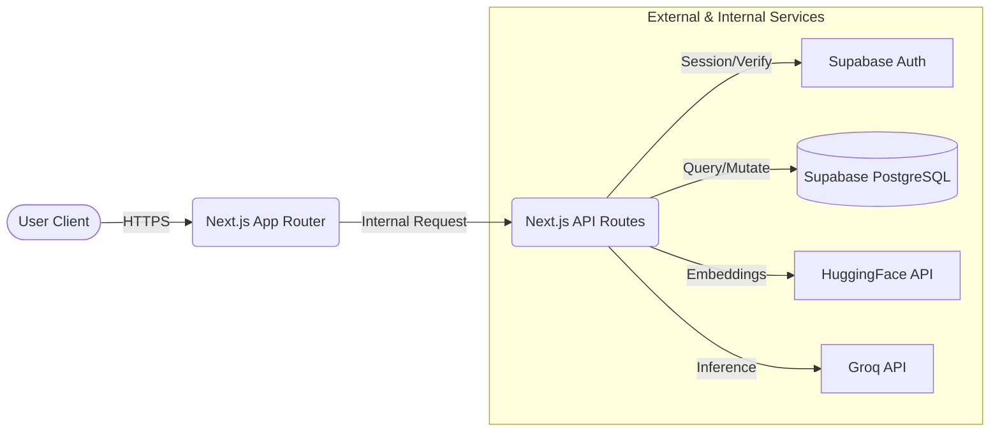
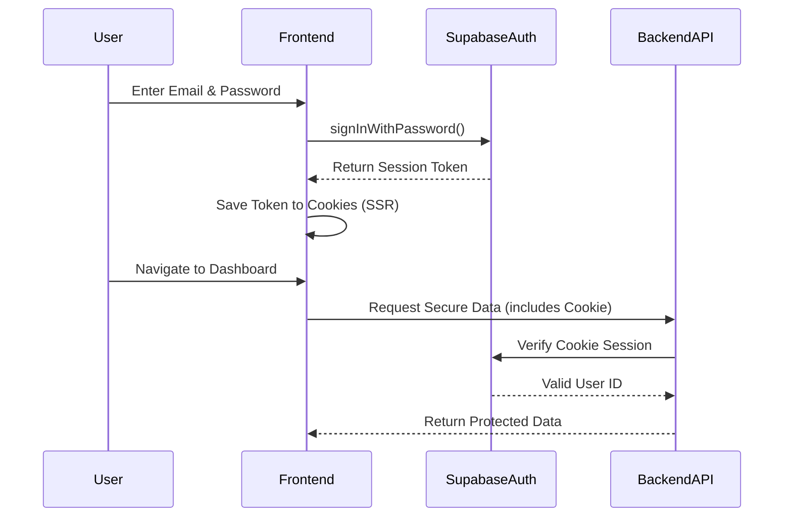
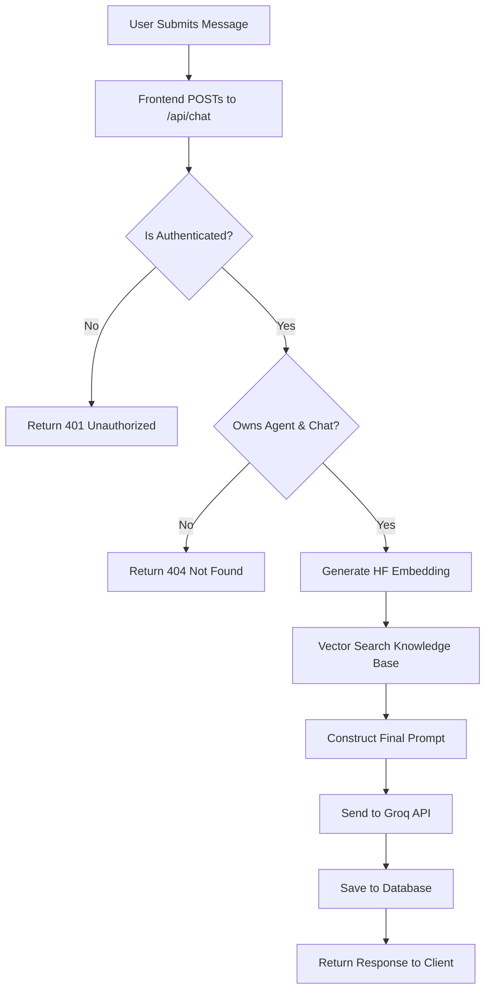

# System Architecture & Design

This document provides an in-depth technical overview of the AgentHub architecture, component interactions, and data flow.

---

## 1. System Overview

AgentHub is a Retrieval-Augmented Generation (RAG) platform. It allows users to authenticate, create isolated workspaces (projects), upload knowledge, and interact with an AI agent that grounds its answers in the provided knowledge base. The system relies on a serverless paradigm powered by Next.js.

---

## 2. Architecture Diagram

### High-Level Architecture

---

## 3. Component Architecture

The application is heavily decoupled into three distinct layers:
1. **Presentation Layer (Frontend)**: React 19 / Next.js 16 components styled with Tailwind CSS v4 and Shadcn.
2. **Business Logic Layer (Backend API)**: Next.js API Routes (`app/api/*`) containing the RAG pipeline, input validation, and ownership checks.
3. **Data & AI Layer**: External SaaS platforms (Supabase for Auth/DB, HuggingFace for Embeddings, Groq for Inference).

---

## 4. Frontend Architecture

The frontend uses the **Next.js App Router**:
* **Client Components (`"use client"`)**: Used strictly for interactive UI elements (e.g., chat interfaces, login forms).
* **Server Components**: Used where possible to reduce bundle size and securely fetch initial data.
* **State Management**: React `useState` and `useRouter` for local state and navigation.

---

## 5. Backend Architecture

The backend consists of serverless functions deployed as Next.js API Routes.
* They are completely stateless.
* Configuration is extracted from environment variables at runtime.
* The backend acts as a secure proxy between the client and the AI providers, ensuring API keys are never exposed.

---

## 6. Authentication Architecture

### Authentication Flow

Email verification is strictly enforced during the login step in `app/login/page.tsx` by verifying `data.user.email_confirmed_at`.

---

## 7. Database Architecture

The system utilizes PostgreSQL via Supabase. Key tables (inferred from application logic):
* `projects`: Stores agent configurations and ownership (`user_id`).
* `prompts`: Stores the system instructions for agents.
* `conversations`: Groups chat messages logically.
* `messages`: Stores the actual chat history.
* `knowledge` (or similar): Stores the text chunks and their pgvector embeddings for similarity search.

Row Level Security (RLS) policies are highly recommended in the database to complement the backend ownership checks.

---

## 8. AI/LLM Architecture

The AI architecture is a two-step RAG process:
1. **Embedding**: The user's query is expanded (using a semantic expansion algorithm) and sent to HuggingFace to generate a 384-dimensional vector.
2. **Inference**: The retrieved context is compiled into a strict system prompt containing anti-hallucination guardrails and sent to Groq for generation.

---

## 9. API Architecture

* **`/api/chat`**: The primary intelligence endpoint. Expects a POST request with `agentId`, `message`, and `conversationId`. Returns JSON containing the AI response and error states.
* **`/auth/confirm`**: Handles the Supabase email magic link / OTP redirect loop, verifying the user and redirecting to the dashboard.

---

## 10. Chat Request Lifecycle

---

## 11. Data Flow

Data flows linearly from the client to the backend, is enriched by external APIs, stored in the database, and returned to the client. No complex pub/sub or background workers are used, ensuring simplicity and low latency.

---

## 12. Error Handling

* **Frontend**: UI displays toasts or inline error messages (e.g., "Please verify your email").
* **Backend**: APIs wrap all external calls (Supabase, Groq, HF) in `try/catch` blocks and return standardized JSON error objects with appropriate HTTP status codes (400, 401, 404, 500).

---

## 13. Security Architecture

* **Authorization**: The backend strictly validates `user_id == auth.uid()` on every request.
* **Anti-Hallucination**: The system prompt is dynamically injected with a critical instruction forcing the LLM to admit ignorance if data is missing, preventing hallucinated sales pitches.
* **Environment Secrets**: All keys (Groq, HF) are strictly server-side.

---

## 14. Scalability

The application relies on serverless compute and managed PostgreSQL.
* **Horizontal Scaling**: Next.js API routes scale automatically under load.
* **Connection Pooling**: Handled seamlessly by Supabase infrastructure.

---

## 15. Performance

* **Groq**: Chosen specifically to provide near-instant text generation (often >500 tokens/second).
* **App Router**: Uses modern Next.js optimizations to minimize client-side JavaScript.

---

## 16. Extensibility

The `lib/` directory abstracts away the embedding (`lib/embeddings.ts`) and AI logic. This means replacing HuggingFace with OpenAI embeddings, or Groq with Anthropic, only requires changing isolated helper functions rather than rewriting API routes.

---

## 17. Reliability

If the HuggingFace API goes down, the system gracefully degrades by failing the API request and returning a 500 error to the frontend, preventing corrupted or incomplete database records.

---

## 18. Non-Functional Requirements (Trade-offs)

* **Performance vs. Ecosystem**: Groq was chosen over OpenAI for speed. The trade-off is a smaller variety of available models.
* **Serverless vs. WebSockets**: WebSockets were eschewed in favor of stateless HTTP POST requests to maximize scalability and simplify deployment, trading off real-time streaming (which can be added later via SSE).

---

## 19. Future Improvements

1. **Streaming**: Implement Next.js App Router streaming (`ai` SDK) to reduce perceived latency.
2. **Caching**: Cache identical embedding requests using Redis/Upstash to save API calls.
3. **Admin Dashboard**: Implement an administrative view to monitor token usage and system health.
